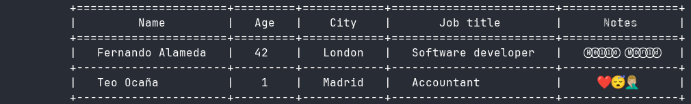
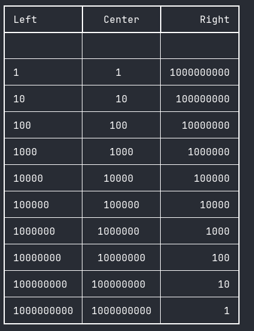
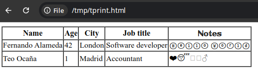

# tprint

A simple Rust crate to print tabular data.
A similar C++ library: [libtprint](https://github.com/wizzard/libtprint)

## Features

* Optional support for Unicode
* output to a String / file
* output as HTML table
* ASCII borders / Unicode borders

## Examples

### Basic example

```rust
use tprint::{TPrint, TPrintAlign};

fn main() {
    TPrint::new(true, true, 10, 3).
        column_add("Name", TPrintAlign::Center, TPrintAlign::Left).
        column_add("Age", TPrintAlign::Center, TPrintAlign::Center).
        column_add("City", TPrintAlign::Center, TPrintAlign::Right).
        column_add("Job title", TPrintAlign::Center, TPrintAlign::Left).
        column_add("ℕ𝕠𝕥𝕖𝕤", TPrintAlign::Center, TPrintAlign::Center).
        add_data("Fernando Alameda").
        add_data(42).
        add_data("London").
        add_data("Software developer").
        add_data("Ⓗⓔⓛⓛⓞ Ⓦⓞⓡⓛⓓ").
        add_data("Teo Ocaña").
        add_data(1).
        add_data("Madrid").
        add_data("Accountant").
        add_data("❤️😴🤦🏼‍♂️").
        print();
}
```



### Output to a String

```rust
use tprint::{TPrint, TPrintAlign, TPrintOutputString, TPrintBordersUnicode};
use std::cell::RefCell;
use std::rc::Rc;

fn main() {
    let str_output = Rc::new(RefCell::new(TPrintOutputString::new()));
    let borders = Rc::new(RefCell::new(TPrintBordersUnicode {}));
    let mut str_tprint = TPrint::new_with_borders_output(borders, str_output.clone(), true, true, 0, 1);

    str_tprint.column_add("Left", TPrintAlign::Left, TPrintAlign::Left);
    str_tprint.column_add("Center", TPrintAlign::Center, TPrintAlign::Center);
    str_tprint.column_add("Right", TPrintAlign::Right, TPrintAlign::Right);
    str_tprint.add_data("");
    str_tprint.add_data("");
    str_tprint.add_data("");

    let j:i64 = 10;
    const MAX:u32 = 10;
    for i in 0..MAX {
        str_tprint.add_data(j.pow(i).to_string());
        str_tprint.add_data(j.pow(i).to_string());
        str_tprint.add_data(j.pow(MAX-i-1).to_string());
    }
    str_tprint.print();

    println!("{}", str_output.borrow().get_str());
}
```



### Output to a HTML file

```rust
use tprint::{TPrint, TPrintAlign, TPrintBordersHTML, TPrintOutputFile};
use std::cell::RefCell;
use std::rc::Rc;

const OUT_FILE: &str = "/tmp/tprint.html";

fn main() {
    let output = Rc::new(RefCell::new(TPrintOutputFile::new(OUT_FILE).unwrap()));
    let borders = Rc::new(RefCell::new(TPrintBordersHTML {}));
    TPrint::new_with_borders_output(borders, output, true, true, 0, 1).
        column_add("Name", TPrintAlign::Center, TPrintAlign::Left).
        column_add("Age", TPrintAlign::Center, TPrintAlign::Center).
        column_add("City", TPrintAlign::Center, TPrintAlign::Right).
        column_add("Job title", TPrintAlign::Center, TPrintAlign::Left).
        column_add("ℕ𝕠𝕥𝕖𝕤", TPrintAlign::Center, TPrintAlign::Center).
        add_data("Fernando Alameda").
        add_data(42).
        add_data("London").
        add_data("Software developer").
        add_data("Ⓗⓔⓛⓛⓞ Ⓦⓞⓡⓛⓓ").
        add_data("Teo Ocaña").
        add_data(1).
        add_data("Madrid").
        add_data("Accountant").
        add_data("❤️😴🤦🏼‍♂️").
        print();
    println!();
}
```



More examples in `examples` folder.

## License

Licensed under the Apache License, Version 2.0 (the "License").
